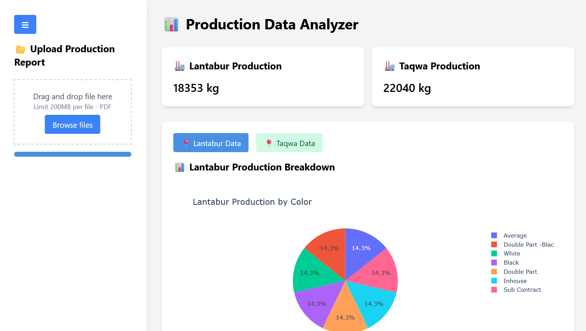

# Production Data Analyzer

The **Production Data Analyzer** is a web application designed to analyze production data from PDF reports. It extracts key metrics, visualizes data using interactive charts, and allows users to download charts and tables as images. The application is built using **Flask** for the backend and **HTML/CSS/JavaScript** for the frontend, with **Plotly** for data visualization and **html2canvas** for capturing tables as images.

---

## Features

- **File Upload**: Upload a PDF file containing production data.
- **Data Extraction**: Extract production totals and breakdowns for Lantabur and Taqwa industries.
- **Interactive Charts**: Visualize production data using pie charts.
- **Data Tables**: Display production breakdowns in a tabular format.
- **Copy to Clipboard**: Copy production data in a formatted text format.
- **Download Charts and Tables**: Download pie charts and tables as PNG images.
- **Responsive Design**: Works seamlessly on both desktop and mobile devices.

---

## Technologies Used

### **Frontend**
- HTML, CSS, JavaScript
- [Tailwind CSS](https://tailwindcss.com/) for styling
- [Plotly](https://plotly.com/javascript/) for interactive charts
- [html2canvas](https://html2canvas.hertzen.com/) for capturing tables as images
- [FontAwesome](https://fontawesome.com/) for icons

### **Backend**
- [Flask](https://flask.palletsprojects.com/) for handling file uploads and data processing
- [pdfplumber](https://github.com/jsvine/pdfplumber) for extracting data from PDFs

---

## Setup Instructions

### **Prerequisites**
- Python 3.x
- Flask
- pdfplumber

### **Installation**

1. **Clone the repository**:
   ```bash
   git clone https://github.com/Solved-Overnight/production-flask.git
   cd production-flask
   ```

2. **Set up a virtual environment (optional but recommended)**:
   ```bash
   python -m venv venv
   source venv/bin/activate  # On Windows: venv\Scripts\activate
   ```

3. **Install dependencies**:
   ```bash
   pip install -r requirements.txt
   ```

4. **Run the Flask application**:
   ```bash
   python app.py
   ```

5. **Access the application**:
   Open your browser and navigate to [http://127.0.0.1:5000](http://127.0.0.1:5000).

---

## Usage

### **Upload a PDF**
- Click the "Browse files" button or drag and drop a PDF file into the upload area.
- The application will automatically analyze the file and display the results.

### **View Production Data**
- The application displays production totals for Lantabur and Taqwa industries.
- Use the tabs to switch between Lantabur and Taqwa data.

### **Interact with Charts**
- Hover over the pie charts to view detailed information.
- Click the "Download Chart" button to save the chart as a PNG image.

### **View and Download Tables**
- The production breakdown is displayed in a table format.
- Click the "Toggle Table" button to show/hide the table.
- Click the "Download Table" button to save the table as a PNG image.

### **Copy Data to Clipboard**
- Click the "Copy to Clipboard" button to copy the production data in a formatted text format.

---

## File Format

The application expects the PDF file to have the following structure:

```
Lantabur Prod. <total>: Total production for Lantabur.
Taqwa Prod. <total>: Total production for Taqwa.
Tables: Tables containing production breakdowns by color, quantity, and percentage.
```

### **Example Output**

#### **Production Totals**
```
Lantabur Production: 18,353 kg
Taqwa Production: 22,040 kg
```

#### **Lantabur Production Breakdown**
```
Color: Average, Double Part - Black, White, Black, Double Part
Quantity: 6,904 kg, 1,442.8 kg, 1,971 kg, 6,082 kg, 1,953.4 kg
Percentage: 37.62%, 7.86%, 10.74%, 33.14%, 10.64%
```

#### **Taqwa Production Breakdown**
```
Color: Average, White, Double Part, Royal
Quantity: 12,044.2 kg, 5,968 kg, 4,023 kg, 5 kg
Percentage: 54.65%, 27.08%, 18.25%, 0.02%
```

---

## Screenshots

### **Flask Backend**


### **Streamlit Backend**


---

## License

This project is licensed under the **MIT License**. See the LICENSE file for details.

---

## Contributing

Contributions are welcome! Please follow these steps:

1. Fork the repository.
2. Create a new branch:
   ```bash
   git checkout -b feature/YourFeature
   ```
3. Commit your changes:
   ```bash
   git commit -m 'Add some feature'
   ```
4. Push to the branch:
   ```bash
   git push origin feature/YourFeature
   ```
---

## Acknowledgments

- [Plotly](https://plotly.com/javascript/) for interactive charting.
- [html2canvas](https://html2canvas.hertzen.com/) for capturing tables as images.
- [Tailwind CSS](https://tailwindcss.com/) for utility-first CSS styling.

---

## Contact

For questions or feedback, please contact:

- **Moniruzzaman Rishad**  
- **Email**: mzrishad.info@gmail.com  
- **GitHub**: [Solved-Overnight](https://github.com/Solved-Overnight)

